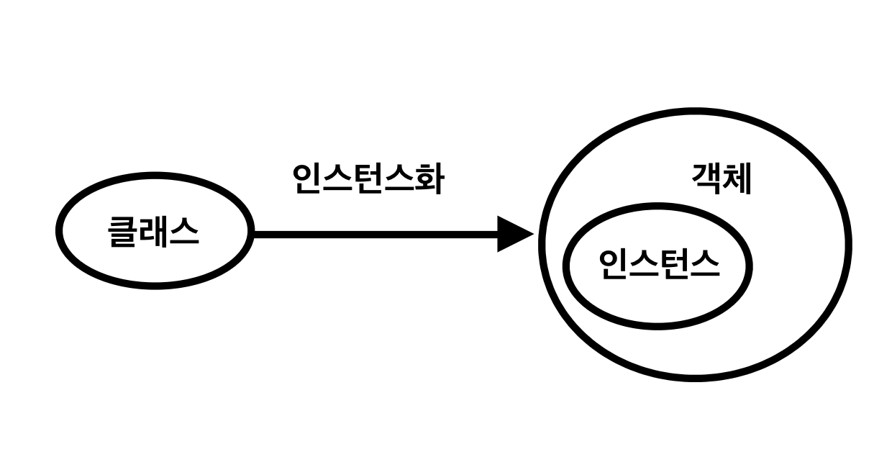

# :question: JAVA

#### reference
https://velog.io/@eunjin/OS-%EC%8B%B1%EA%B8%80%EC%8A%A4%EB%A0%88%EB%93%9C-%EB%A9%80%ED%8B%B0%EC%8A%A4%EB%A0%88%EB%93%9C%EC%9D%98-%EC%9D%98%EB%AF%B8<br>
https://github.com/WooVictory/Ready-For-Tech-Interview/blob/master/Java/%5BJava%5D%20%EC%B6%94%EC%83%81%20%ED%81%B4%EB%9E%98%EC%8A%A4%EC%99%80%20%EC%9D%B8%ED%84%B0%ED%8E%98%EC%9D%B4%EC%8A%A4%EC%9D%98%20%EC%B0%A8%EC%9D%B4.md<br>
https://nesoy.github.io/articles/2018-04/Java-Serialize
<hr>

## Question
1. [쓰레드란 무엇이고, 싱글쓰레드와 멀티쓰레드의 차이를 설명해주세요.]()
<br><br>

2. [클래스는 무엇이고, 객체는 무엇인지 설명해주세요.]()
<br><br>

3. [인터페이스와 추상클래스의 차이점은 무엇인지 설명해주세요.]()
<br><br>

4. [직렬화가 무엇인지 설명하세요.]()
<hr>

## :nerd_face:	What I study
### 1. Thread
- 프로세스로부터 자원을 할당받아 프로세스 내부에서 실행되는 실행 단위
- 한 프로세스 안에는 한 개 이상의 스레드가 존재하여 작업을 수행한다.
- 프로세스 내에서 PC register와 stack을 할당받는다. <br>code, data, heap 영역은 공유한다. -> 그러므로, 좀 더 효율적으로 통신할 수 있다.
- 자원을 많이 사용하지 않아 적은 메모리를 사용할 수 있고, 일부 메모리 영역을 공유하므로 정보 공유를 쉽게 할 수 있다는 장점이 있다.
- 동시에 메모리에 접근하기 때문에 충돌이 안나도록 조심해야 한다.
  - 교착상태에 빠질 수 있다는 단점이 있다.


#### 1-1) Single Thread
- 하나의 프로세스에 하나의 스레드를 실행하는 것을 의미한다.
- 하나의 register와 stack으로 표현된다.
- 자원 접근에 대한 동기화를 신경쓰지 않아도 된다.
- Context Switching이 필요하지 않다.
- 여러 개의 CPU를 활용하지 못한다.
- 단순히 CPU만을 사용하는 계산작업이라면, 오히려 Multi Thread보다 Single Thread로 프로그래밍하는 것이 더 효율적이다.
#### 1-2) Multi Thread
- 하나의 프로세스에 여러 개의 스레드를 만들어 각 스레드가 하나의 작업을 처리하는 것을 의미한다.
- 프로세스 내에서 자원을 공유하여 자원 생성과 관리의 중복을 최소화한다.
- 서버가 많은 요청을 효율적으로 수행할 수 있는 환경을 제공한다.
- 각각의 스레드가 고유한 register와 stack으로 표현된다.
- 새로운 프로세스를 생성하는 것보다 기존 프로세스에서 스레드를 생성하는 것이 빠르다.
- 프로세스의 Context Switching보다 스레드의 Context Switching이 더 빠르다.
- 멀티 스레딩을 위해 OS의 지원이 필요하다.
- 스레드 스케줄링을 신경써야 한다.
<br><br>

### 2. 클래스 vs 객체 vs 인스턴스

#### 클래스(Class)
  - 객체를 만들어 내기 위한 설계도 혹은 틀
  - 객체를 정의해 놓은 것을 의미한다.
  - 객체를 생성하는데 사용되며, 객체는 클래스에 정의된 대로 생성된다.
#### 객체(Object)
  - 소프트웨어 세계에 구현할 대상
  - 클래스에 선언된 모양 그대로 생성된 실체이다.
  - 눈으로 볼 수 있는 형태가 있는 것 뿐만 아니라, 개념이나 논리와 같은 형태가 없는 것도 객체로 간주한다.
  - 모든 인스턴스를 대표하는 포괄적인 의미를 가진다. **(클래스의 인스턴스)**
#### 인스턴스(Instance)
  - 클래스(설계도)를 바탕으로 소프트웨어 세계에 구현된 구체적인 실체이다.
  - 즉, 객체를 소프트웨어에 실체화하면 그것을 인스턴스라고 부른다.
  - 실체화된 인스턴스는 메모리에 할당된다.

```java
public class Car { // 클래스
  ...
}

public class Main { // 객체 & 인스턴스
  public static void main(String[] args) {
    Car bus, taxi; // '객체'

    // 인스턴스화
    bus = new Car(); // bus는 Car 클래스의 '인스턴스'(객체를 메모리에 할당)
    taxi = new Car(); // taxi는 Car 클래스의 '인스턴스'(객체를 메모리에 할당)
  }
}
```
#### 2-1) 클래스 vs 객체
- 클래스는 객체를 만들어 내기 위한 ‘설계도’로 객체를 정의해 놓은 것을 의미한다.
- 객체는 ‘설계도로 구현한 모든 대상’을 의미한다.
#### 2-2) 객체 vs 인스턴스
- 클래스의 타입으로 선언되었을 때 객체라고 부르고, 그 객체가 메모리에 할당되어 실제 사용될 때 인스턴스라고 부른다.
- 객체는 현실 세계에 가깝고, 인스턴스는 소프트웨어 세계에 가깝다.
- 객체는 실체에 초점을 맞추고, 인스턴스는 ‘관계’에 초점을 맞춘다.
- 방금 객체화하여 인스턴스화 된 경우는 원본으로부터 생성되었다는 것에 의미를 부여하는 것일 뿐 **엄격하게 객체와 인스턴스를 나누긴 어렵다.**
<br><br>

### 3. 인터페이스 vs 추상 클래스
### 인터페이스
  - 목적: 구현 객체가 같은 동작을 한다는 것을 보장하는 것
  - 상속받을 자식 클래스에게 구현할 메서드들의 원형을 모두 알려주어, 자식 클래스가 자신의 목적에 맞게 메서드를 구현하도록 하는 것이다.
  - 그러므로, 인터페이스를 구현하는 모든 클래스에 대해 특정한 메소드가 반드시 존재하도록 강제한다.
  - 추상클래스보다 추상화 정도가 높아 추상 메소드 이외의 일반 메소드나 멤버 변수를 구성원으로 가질 수 없다.
  - ***오직 추상 메소드와 상수만 가질 수 있으며, 그 외의 요소는 허용하지 않는다.***
<br>

  - **제약 사항**
    - 모든 멤버 변수는 public, static, final 이어야 한다. (public은 생략 가능)
    - 모든 메소드는 public, abstract 이어야 한다. (public은 생략 가능)
    - JAVA8 부터 인터페이스에 static 메소드와 default 메소드의 추가를 허용했다.
      - default 키워드가 붙은 메소드는 일반 메소드처럼 구현할 수 있어, 자식 클래스에서는 이를 오버라이딩할 수 있다.
      - (왜? 인터페이스가 변경되면 이를 구현하는 모든 클래스들이 해당 메소드를 다시 구현해야하는 번거로운 문제가 있었다. 이런 문제를 해결하기 위하여 인터페이스에 메소드를 구현할 수 있도록 변경되었다.)
      - static 키워드가 붙은 메소드는 간단한 기능을 가지는 유틸리티성 인터페이스를 만들 수 있도록 도와준다.
  - **상속**
    - 인터페이스로부터만 상속 받을 수 있다.
    - 클래스와는 달리 다중 상속이 가능하다.
    - 인터페이스를 상속받아 새로운 인터페이스를 만들 수 있다.
    - 클래스에서 여러 인터페이스를 다중 구현하는 것도 가능하다.
  - **구현**
    - 자신이 직접 인스턴스를 생성할 수 없다.
    - 인터페이스가 포함하고 있는 추상 메소드를 구현할 클래스를 통해 구현해야 한다.
    - 구현한다는 의미의 ```implements``` 키워드를 사용하여 구현한다.
  - **장점**
    - 대규모 프로젝트 개발 시 일관되고 정형화된 개발을 위한 표준화가 가능하다.
    - 클래스의 작성과 인터페이스의 구현을 동시에 진행할 수 있으므로, 개발 시간을 단축할 수 있다.
    - 클래스와 클래스 간의 관계를 인터페이스로 연결하면 클래스마다 독립적인 프로그래밍이 가능하다.
      - 서로 관련이 없는 클래스에서 공통적으로 사용하는 방식이 필요하지만, 기능을 각각 구현할 필요가 있는 경우에 사용한다.
<br>

### 추상 클래스
  - 목적: 1) 공유 및 2) 추상 클래스의 추상 메소드를 자식 클래스가 구체화하여 기능을 확장하는 것
  - 기존의 클래스에서 공통된 부분을 추상화(추상 메소드)하여 상속하는 클래스에게 구현을 강제화한다. 즉, 메소드의 동작은 구현하는 자식 클래스에게 위임한다.
  - 클래스 앞에 abstract 키워드를 붙인다.
  - 클래스를 작성하는데 있어 어느정도 작성된 상태에서 시작할 수 있다.
<br>

  1. **미완성된 메소드인 추상 메소드를 최소 한 개 이상 포함하고 있다.**
     - 선언부만 작성하고 구현부를 작성하지 않는 이유? 메소드의 내용이 상속받은 클래스에 따라 달라질 수 있기 때문 
     - 최소 한 개의 추상 메소드를 포함하고 있는 경우 반드시 추상 클래스로 선언해야 한다.
  ```java
  abstract class Audio { // 추상 클래스
  Audio() {...}
  void play() {...}
  abstract public void stop(); // 추상 메서드
  }
  ```
  ```java
  class Samsung extends Audio { // 추상 클래스 구현
  public void stop() { System.out.println("재생을 멈춥니다."); } // 오버라이딩하여 추상메소드를 구현
  void update() { System.out.println("소프트웨어 업데이트중입니다."); }
  }
  ```
  2. **추상 메소드가 없어도 추상 클래스로 선언할 수 있다.**
     - 추상 메소드가 하나도 없는 경우라도 추상 클래스로 선언할 수 있다.
   ```java
   abstract class Audio { // 추상 클래스
   Audio() {...}
   void play() {...}
   }
   ```
<br>

  - **제약 사항**
    - 추상 메소드가 아닌 일반 메소드, 멤버 변수도 포함할 수 있다. 
    - 추상 메소드를 하나라도 포함하고 있다면 추상 클래스로 선언해야 한다.
  - **상속**
    - 일반 클래스가 추상클래스를 상속받을 경우, 추상 클래스를 상속받은 자식 클래스는 오버라이딩을 통해 조상인 추상 클래스의 추상 메소드를 모두 구현해야 한다.
    - 하지만, 추상클래스가 추상클래스를 상속받은 경우에는 반드시 모든 추상 메소드를 구현해야 하는 것은 아니다.
      - 만약, 자식 클래스에서 추상 메소드를 하나라도 구현하지 않는다면 자식 클래스 역시 추상 클래스로 지정해야 한다.
  - **구현**
    - 동작이 정의되어 있지 않은 추상 메소드를 포함하고 있으므로 인스턴스를 생성할 수 없다.
    - 자식 클래스에서 조상 클래스의 모든 추상 메서드를 **오버라이딩**하여 실행가능한 코드로 구현한다.
    - 상속받는다는 의미의 ```extends``` 키워드를 사용하여 구현한다.
<br>

#### 3-1) 인터페이스 vs 추상 클래스

|인터페이스와 추상 클래스의 공통점|
|:---:|
|객체(인스턴스)는 생성할 수 없다.|
|자식 클래스가 메소드의 구체적인 동작을 구현하도록 책임을 위임한다.|

<hr>

|차이점|인터페이스|추상 클래스|
|:---:|:---:|:---:|
|목적|구현 객체의 같은 동작을 보장|상속을 통한 공유로 기능을 확장|
|클래스|X|O (주로 베이스 클래스로 사용)|
|포함|추상 메소드, 상수|추상 메소드, 일반 메소드, 멤버 변수|
|상속|단일 상속, 다중 상속|단일 상속|

<br><br>

### 4. 직렬화(Serialize)
- 자바 시스템 내부에서 사용되는 Object 또는 Data를 외부의 자바 시스템에서도 사용할 수 있도록 byte 형태로 데이터를 변환하는 기술이다.
- JVM의 메모리 영역(Heap, Stack)에 상주되어 있는 객체 데이터를 byte 형태로 변환한다.
- 직렬화 기본 조건: ```java.io.Serializable``` 인터페이스를 상속받은 객체
- 변수의 타입에 엄격하다.
- 데이터 사이즈가 커진다.
#### 4-1) 필요성
- 복잡한 데이터 구조를 가진 클래스의 객체라도 직렬화 기본 조건만 지키면 큰 작업 없이 바로 직렬화, 역직렬화가 가능하다.
- 데이터 타입이 자동으로 맞춰지기 때문에 관련 부분을 신경 쓰지 않아도 된다.
```
- 외부 저장소로 저장되는 데이터는 짧은 만료시간의 데이class터를 제외하고 
  자바 직렬화를 사용하지 않도록 한다.
- 역직렬화시 반드시 예외가 생긴다는 것을 생각하고 개발한다.
- 자주 변경되는 비즈니스적인 데이터를 자바 직렬화을 사용하지 않는다.
- 긴 만료 시간을 가지는 데이터는 JSON 등 다른 포맷을 사용하여 저장한다.
```
<br>

### 5. 역직렬화(Deserialize)
- byte로 변환된 Data를 원래대로 Object나 Data로 변환하는 기술이다.
- 직렬화된 byte 형태의 데이터를 객체로 변환해서 JVM으로 상주시키는 형태이다.
#### 5-1) 조건
- 직렬화 대상이 된 객체의 클래스가 클래스 패스에 존재해야 하고 import되어 있어야한다.
- 직렬화와 역직렬화를 진행하는 시스템이 서로 다를 수 있다는 것을 반드시 고려해야 한다.
- 자바 직렬화 대상 객체는 동일한 serialVersionUID 를 가지고 있어야 한다.
  - 모델의 버젼간의 호환성을 유지하기 위해, serialVersionUID 를 정의한다.
