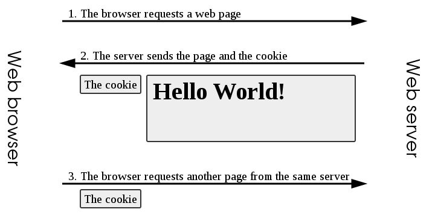

# 쿠키, 세션, 캐시의 차이
: HTTP 프로토콜의 약점을 보완하기 위해 사용
- Connectioneless (비연결지향)
  - HTTP 프로토콜을 이용한 Request/Response 시 연결을 계속 유지하지 않는다
- Stateless (상태정보 유지X)
  - 서버는 클라이언트의 상태를 저장하지 않는다

실제로는 로그인 저장, 장바구니 유지 등 데이터를 유지해야 할 필요가 있다
-> 이러한 Stateless 특성을 극복하기 위해 **쿠키**와 **세션**을 사용한다

## 쿠키
: 인터넷 사용자가 어떠한 웹 사이트를 방문할 경우 그 사이트가 사용하고 있는 서버를 통해 인터넷 사용자의 컴퓨터에 설치되는 기록 정보 파일

- 이름
- 값
- 0개 이상의 속성(이름/값 쌍) - 쿠키 만료 시간, 도메인, 플래그 등의 정보

#### 쿠키의 구현
    웹 브라우저에 의해 송신되며 웹 브라우저에 의해 클라이언트 컴퓨터에 저장됨
    이후 브라우저는 상태를 Stateless 트랜잭션으로 유입시키면서 모든 요청을 서버로 전달

#### 쿠키의 동작 순서

1. 클라이언트가 페이지를 요청한다. (사용자가 웹사이트 접근)
2. 웹 서버는 쿠키를 생성한다.
3. 생성한 쿠키에 정보를 담아 HTTP 화면을 돌려줄 때, 같이 클라이언트에게 돌려준다.
4. 넘겨 받은 쿠키는 클라이언트가 가지고 있다가(로컬 PC에 저장)다시 서버에 요청할 때 요청과 함께 쿠키를 전송한다.
5. 동일 사이트 재방문시 클라이언트의 PC에 해당 쿠키가 있는 경우, 요청 페이지와 함께 쿠키를 전송한다.

#### 쿠키의 활용
> 1. 아이디, 비밀번호 자동 저장
> 2. 팝업창에서의 "오늘 하루 이 창을 열지 않기" 체크

## 세션
: 반영구적이고 상호정보적인 정보 교환을 전제하는 둘 이상 간의 연결 상태

일정 시간(브라우저를 통해 웹 서버에 접속한 시간 or 특정 시간) 동안 상태를 유지한다

- 웹 서버에 저장되는 쿠키
- 브라우저를 닫거나 서버에서 세션을 삭제했을 때 같이 지워지므로 쿠키보다 보안이 좋다
- 저장 데이터에 제한이 없다

#### 세션의 특징
1. 클라이언트가 페이지를 요청한다. (사용자가 웹사이트 접근)
2. 서버는 접근한 클라이언트의 Request-Header 필드인 Cookie를 확인하여, 클라이언트가 해당 session-id를 보냈는지 확인한다
3. session-id가 존재하지 않는다면, 서버는 session-id를 생성해 클라이언트에게 돌려준다.
4. 서버에서 클라이언트로 돌려준 session-id를 쿠키를 사용해 서버에 저장한다. 쿠키 이름 : JSESSIONID
5. 클라이언트는 재접속 시, 이 쿠키(JSESSIONID)를 이용하여 session-id 값을 서버에 전달

#### 쿠키의 활용
> 1. 화면을 이동해도 로그인을 유지
> 2. 쇼핑 사이트에서 장바구니 기능

## 쿠키 VS 세션

||쿠키|세션|
|-|-|-|
|저장 위치|클라이언트|웹 서버|
|저장 형식|text|Object|
|만료 시점|쿠키 저장 시 설정 (브라우저가 종료되어도 남아있음)|브라우저 종료 시 삭제 (기간 지정 가능)|
|사용 자원|클라이언트 리소스|서버 리소스|
|용량 제한|총 300개 한 도메인 당 20개 하나의 쿠키 당 4KB|서버가 허용하는 한 무제한|
|속도|세션보다 빠름|쿠키보다 느림|
|보안|비교적 취약|비교적 안전|