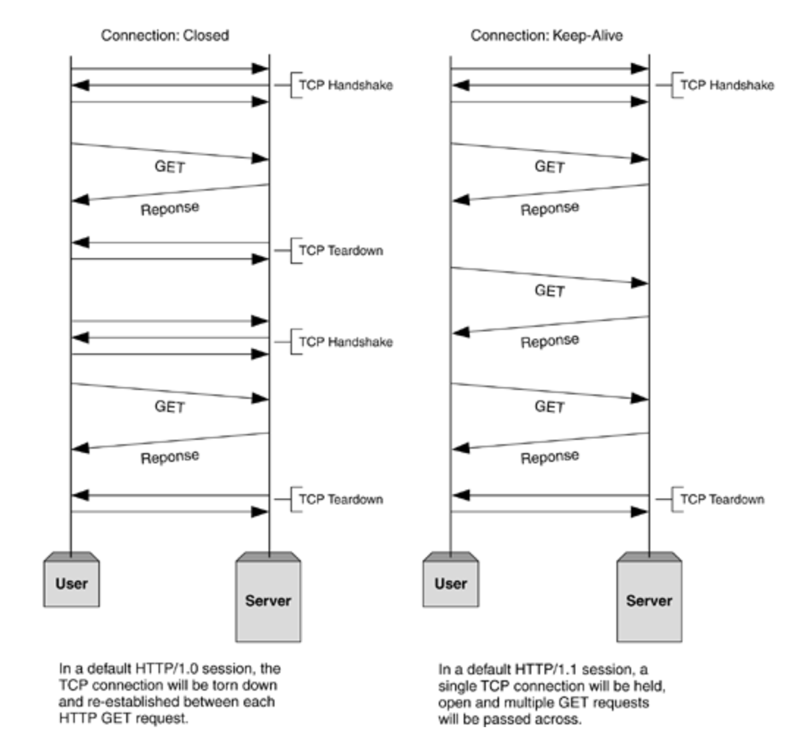

# 7계층 프로토콜 HTTP

## HTTP 프로토콜

웹을 만드는 기술들

- 필수

  > **HTTP(HTTPS -> SSL/TLS), HTML, Javascript, CSS**, ASP/ASP.NET, **JSP**, PHP, DB

- 선택
  > Python, Spring, Jquery, Ajax

 

## HTTP 프로토콜

: HyperText Transfer Protocol(하이퍼 텍스트 전송 프로토콜)

> www에서 쓰이는 핵심 프로토콜로 문서의 전송을 위해 쓰이며, 오늘날 거의 모든 웹 애플리케이션에서 사용되고 있다.  
>  -> 음성, 화상 등 여러 종류의 데이터를 MIME로 정의하여 전송 가능

### HTTP 특징

: Request/Response (요청/응답) 동작에 기반하여 서비스 제공

### HTTP 1.0

: "연결 수립, 동작, 연결 해제"의 단순함이 특징 -> 하나의 URL은 하나의 TCP 연결
HTML 문서를 전송 받은 뒤 연결을 끊고 다시 연결하여 데이터를 전송한다

#### 문제점: 단순 동작(연결 수립, 동작, 연결 해제)이 반복되어 통신 부하 문제 발생

### HTTP Request Protocol

: 요청하는 방식을 정의하고 클라이언트의 정보를 담고 있는 Request Protocol 구조

- Request Line
- Header
- Empty Line
- Body

#### Request Line

| **요청 타입** | 공백 | **URI** | 공백 | HTTP 버전 |
| ------------- | ---- | ------- | ---- | --------- |

 

##### HTTP Method

| GET                                              | POST                                     |
| ------------------------------------------------ | ---------------------------------------- |
| 특정 데이터를 요청                               | 클라이언트가 서버로 데이터를 전송        |
| URI에 요청 데이터를 query string으로 붙여서 전송 | HTTP Request Body에 데이터를 넣어서 전송 |

 

### URI(Uniform Resource Identifier)
: 인터넷 상에서 특정 자원(파일)을 나타내는 유일한 주소

**scheme://host[:port][/path][?query]**   
ex) 
- ftp  : //IP주소 :포트 /파일이름
- http : //IP주소(도메인주소) :포트 /폴더이름/파일이름

### HTTP Response Protocol

 

#### Request Line

| **HTTP 버전** | 공백 | **상태 코드** | 공백 | 상태 문구 |
| ------------- | ---- | ------- | ---- | --------- |

 

#### Response Status Code

HTTP Status Code는 100 ~ 511번까지 존재

각각의 백의 자리 숫자에 따라

- 1xx (정보): 요청을 받았으며 프로세스를 계속한다
- 2xx (성공): 요청을 성공적으로 받았으며 인식했고 수용하였다
- 3xx (리다이렉션): 요청 완료를 위해 추가 작업 조치가 필요하다
- 4xx (클라이언트 오류): 요청의 문법이 잘못되었거나 요청을 처리할 수 없다
- 5xx (서버 오류): 서버가 명백히 유효한 요청에 대해 충족을 실패했다

 

##### 대표적인 Status Code
- 200-OK: Client의 요청이 성공했다는 것을 나타낸다
- 403-Forbidden: Client가 권한이 없는 페이지를 요청했을 때
- 404-Not Found: Client가 서버에 없는 페이지를 요청했을 때
- 500-Internal Server Error: Server의 일부가 멈췄거나 설정 오류가 발생
- 503-Service Unavailable: 최대 Session 수를 초과했을 때

 

### HTTP 헤더 포맷

#### 일반 헤더

|헤더 종류|설명|
|-|-|
|Content-Length|메시지 바디 길이를 나타낼 때 쓰인다|
|Content-Type|메시지 바디에 들어있는 컨텐츠 종류(Ex: HTML 문서는 text/html)|

 

#### 요청 헤더

|헤더 종류|설명|
|-|-|
|Cookie|서버로부터 받은 쿠키를 다시 서버에게 보내주는 역할|
|**Host**|요청된 URL에 나타난 호스트명을 상세하게 표시(HTTP 1.1은 필수)|
|User-Agent|Client Program에 대한 식별 가능 정보 제공|

 

#### 응답 헤더

|헤더 종류|설명|
|-|-|
|Server|사용하고 있는 웹서버의 소프트웨어에 대한 정보 포함|
|Set-Cookie|쿠키를 생성하고 브라우저에 보낼 때 사용. 해당 쿠키 값을 브라우저가 서버에게 다시 보낼 때 사용한다|