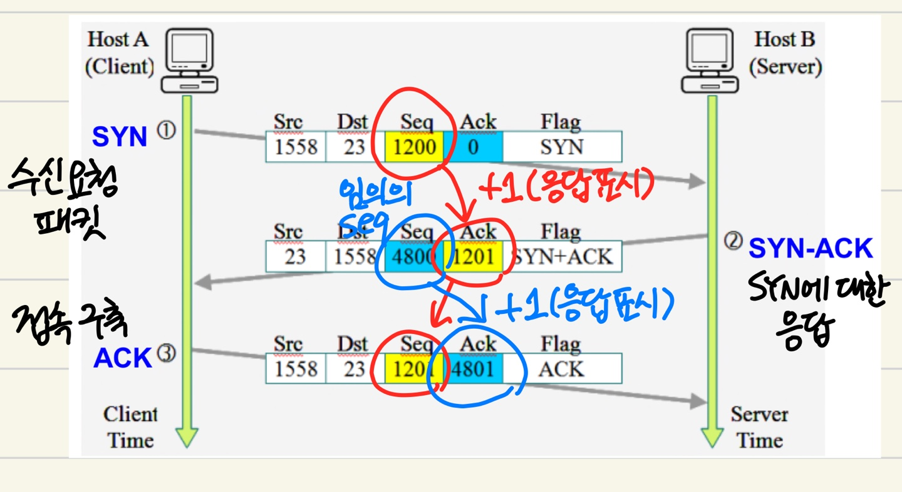
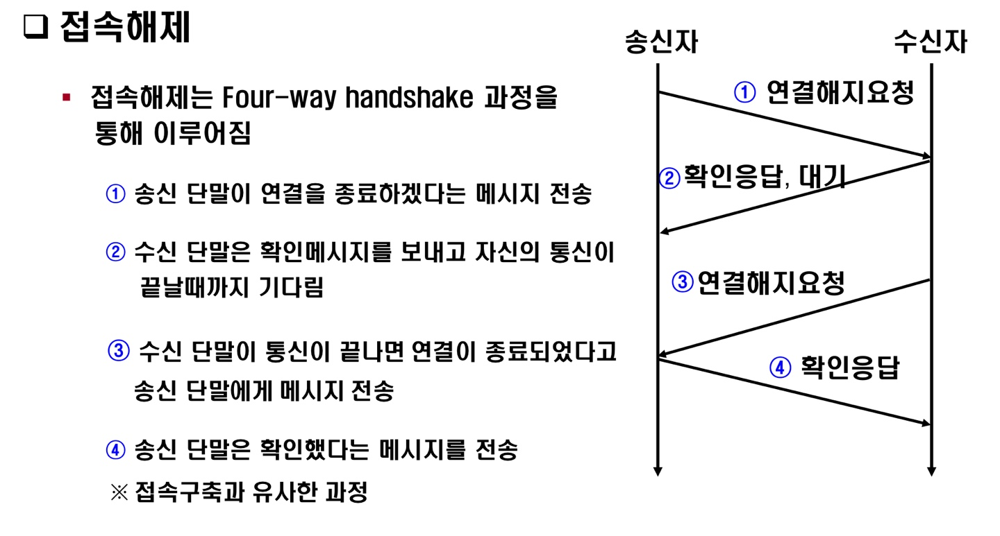

# 연결지향형 TCP 프로토콜

네이버 D2 포스팅 -  [TCP/IP 네트워크 스택 이해하기](https://d2.naver.com/helloworld/47667)

## TCP Protocol - Transmission Control Protocol
전송 제어 프로토콜은 인터넷에 연결된 컴퓨터에서 실행되는 프로그램 간에 통신을 **안정적으로, 순서대로, 에러없이** 교환할 수 있게 한다.

TCP의 안정성을 필요로 하지 않는 애플리케이션의 경우 일반적으로 TCP 대신 비접속형 사용자 데이터그램 프로토콜(UDP)를 사용한다.

TCP는 UDP보다 안전하지만 느리다는 단점이 있다.   
 

TCP는 4계층(전송) 프로토콜이고, IP는 3계층(네트워크) 프로토콜이라 분리된 것 이지만, 대부분의 인터넷 서비스가 TCP/IP 기반으로 동작하기 때문에 함께 보는 경우가 많다().   
TCP 프로토콜의 핵심 요소는 

- source port: 송신 포트
- destination port: 수신 포트
- sequence number
  - SYN Flag(1): 초기 시퀀스 번호. 실제 데이터의 최초 바이트 값과 그에 상응하는 ACK 번호는 이 값에 +1을 더한 값
  - SYN Flag(0): 현재 세션에서의 세그먼트 데이터의 최초 바이트 값의 누적 시퀀스 번호
- acknowledgment number: 수신자가 예상하는 다음 시퀀스 번호
- offset: TCP 헤더의 길이
- reserved: 사용되지 않는 필드
- window: 수신 윈도우의 크기
- checksum: 헤더 및 데이터의 에러 확인을 위해 사용되는 16비트 비트
- tcp options

### tcp flags
- U: 긴급 bit(우선순위 높음)
- A: Ack bit(승인에 대한 응답)
- P: Push bit(데이터의 포화 여부에 상관 없이 전송, 우선순위 낮음)
- R: Reset bit(연결이 되어 있는 상태에서 문제가 발생했을 때 연결 관계 초기화)
- S: Syn bit(동기화 비트, 상대방과 연결을 할 때 무조건 사용)
- F: Fin bit(종료 비트)

## TCP를 이용한 통신 과정

### 3-Way Handshake
TCP를 이용한 데이터 통신을 할 때 프로세스와 프로세스를 연결하기 위해 가장 먼저 수행하는 과정

1. 클라이언트가 서버에게 요청 패킷 전송
2. 서버가 클라이언트의 요청을 받아들이는 패킷 전송
   - 1번 패킷에서 받은 Seq + 1을 Ack로 보냄(동기화)
3. 클라이언트가 이를 수락하는 패킷 전송
   - 2번 패킷에서 받은 Seq + 1을 Ack로 보냄
   - 2번 패킷에서 받은 Ack를 Seq로 보냄

이러한 3개의 과정을 **3-Way Handshake**라고 한다

### 데이터 송수신 과정

TCP를 이용한 데이터 통신을 할 때 단순히 TCP 패킷만을 캡슐화해서 통신하는 것이 아닌 페이로드를 포함한 패킷을 주고 받을 때의 일정한 규칙

1. 보낸 쪽에서 또 보낼 때는 Seq 번호와 Ack 번호가 그대로다
2. 받는 쪽에서 보내는 Seq 번호는 받은 Ack 번호가 된다
3. 받는 쪽에서 보내는 Ack 번호는 받은 Seq 번호 + 데이터 크기가 된다

### 4-way Handshake

연결 종료 시 사용하는 방식
1. 송신 단말이 연결 종료 요청
2. 확인 메시지 보내고 통신 종료 대기
3. 연결 종료 메시지 전송
4. 확인 메시지 전송

## TCP 상태전이도

- LISTEN: 클라이언트와의 연결을 기다리는 상태
- ESTABLISHED: 클라이언트와 연결이 완료된 상태

## 신뢰성 있는 연결을 위한 제어

- 흐름 제어 
   수신측에서 설정한 **슬라이딩 윈도우** 크기만큼 응답없이 송신하여 데이터 발생률을 조정하는 기법
   우선 윈도우(메모리 버퍼의 일정 영역)에 모든 패킷을 전송한 뒤 패킷들의 전달이 확인되는 채로 윈도우를 옆으로 옮겨 그 다음 패킷을 전송
- 혼잡 제어
   네트워크 상태를 고려한 데이터 전송 속도 조절
   ACK 패킷의 수신되는 정도를 통해 혼잡 상태 파악 후 슬라이딩 윈도우의 크기 조절
- 오류 제어(Ack-retransmission)
