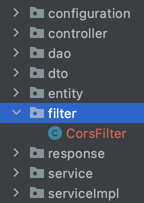

# :question: Spring에서의 CORS

#### reference
https://wonit.tistory.com/572<br>
https://oingdaddy.tistory.com/243<br>
https://oddpoet.net/blog/2017/04/27/cors-with-spring-security/
<hr>

## Question
1. Spring에서 [CORS 에러](../../network/jsy/etc.md)를 해결하기 위해 했던 방법은 무엇인가요?
- 컨트롤러에서 CORS를 처리해야하는 `컨트롤러 상단부에 @CrossOrigin 어노테이션을 추가`하여 해결했습니다.
- 이외에도, `Servlet Filter를 사용하여 커스텀한 CorsFilter를 설정`하거나, `WebMvcConfiguer를 구현한 설정 클래스(@Configuration)를 만들어서 addCorsMappings 메소드를 재정의`하는 방법이 있습니다.
- Spring Security를 사용했다면, `CorsConfigurationSource를 Bean으로 등록하고 config에 추가`해주는 방법도 있습니다.
<hr>

## :nerd_face:	What I study
### Spring에서 CORS 에러 해결 방법

<br>

### 1. javax.servlet의 Filter를 사용하여 Custom CorsFilter 생성
- CorsFilter로 직접 response에 header를 넣어주는 방법

1. filter라는 디렉토리 안에 CorsFilter 클래스를 만든다.



2. CorsFilter 클래스를 Bean으로 등록한다.
- @Component 어노테이션을 추가하고, Filter 인터페이스를 구현하여 Override한다.
- :star: `javax.servlet.Filter`를 import하여 인터페이스를 구현해야한다 !

```java
import org.springframework.core.Ordered;
import org.springframework.core.annotation.Order;
import org.springframework.stereotype.Component;

import javax.servlet.*;
import java.io.IOException;

@Component
@Order(Ordered.HIGHEST_PRECEDENCE)
public class CorsFilter implements Filter {
    @Override
    public void init(FilterConfig filterConfig) throws ServletException {
        Filter.super.init(filterConfig);
    }

    @Override
    public void doFilter(ServletRequest request, ServletResponse response, FilterChain chain) throws IOException, ServletException {

    }

    @Override
    public void destroy() {
        Filter.super.destroy();
    }
}
```

3. 해당 필터를 실제로 수행할 `doFilter`를 Override한다.
- CORS에 필요한 헤더를 OPTIONS가 잘 확인할 수 있도록 설정한다.

```java
import javax.servlet.http.HttpServletRequest;
import javax.servlet.http.HttpServletResponse;

...

    @Override
    public void doFilter(ServletRequest request, ServletResponse response, FilterChain chain) throws IOException, ServletException {
        HttpServletRequest req = (HttpServletRequest) request;
        HttpServletResponse res = (HttpServletResponse) response;

        res.setHeader("Access-Control-Allow-Origin", "http://localhost:3000");
        res.setHeader("Access-Control-Allow-Credentials", "true");
        res.setHeader("Access-Control-Allow-Methods","*");
        res.setHeader("Access-Control-Max-Age", "3600");
        res.setHeader("Access-Control-Allow-Headers",
                "Origin, X-Requested-With, Content-Type, Accept, Authorization");

        if("OPTIONS".equalsIgnoreCase(req.getMethod())) {
            res.setStatus(HttpServletResponse.SC_OK);
        }else {
            chain.doFilter(request, response);
        }
    }

...

```

<br>

### 2. @CrossOrigin 사용
- Controller에서 @CrossOrigin 어노테이션 추가하는 방법
- 컨트롤러에서 `특정 메소드` 혹은 `컨트롤러 상단부`에 @CrossOrigin을 추가한다.
- 컨트롤러가 많을수록 설정해야하는 어노테이션이 많아진다.

```java
@RestController
@RequestMapping("/users")
@CrossOrigin(origins = "http://front-server.com") // 컨트롤러에서 설정
@RequiredArgsConstructor
public class UserController {
    private final UserService userService;

    @PostMapping("/signup")
    @CrossOrigin(origins = "http://front-server.com") // 메서드에서 설정
    public Response<SignUpOutput> signUp(@RequestBody SignUpInput signUpInput) {
        return userService.signUp(signUpInput);
    }
}
```

<br>

### 3. WebMvcConfigurer의 addCorsMappings 함수 사용
- WebMvcConfigurer를 사용하는 방법

<br>

1.  main 함수에서 Bean으로 Configurer를 추가한다.
```java
import org.springframework.boot.SpringApplication;
import org.springframework.boot.autoconfigure.SpringBootApplication;
import org.springframework.context.annotation.Bean;
import org.springframework.web.servlet.config.annotation.CorsRegistry;
import org.springframework.web.servlet.config.annotation.WebMvcConfigurer;

@SpringBootApplication
public class Application {

    public static void main(String[] args) {
        SpringApplication.run(Application.class, args);
    }

    @Bean
    public WebMvcConfigurer corsConfigurer() {
        return new WebMvcConfigurer() {
            @Override
            public void addCorsMappings(CorsRegistry registry) {
                registry.addMapping("/**") // 모든 요청에 대해서
                .allowedOrigins("http://front-server.com"); // 허용할 오리진들
            }
        };
    }
}
```

<br>

2. 전역설정을 통해서 Cross Origin을 허용할 수도 있다.
- @Configuration을 사용한 클래스에서 등록한다.
- WebMvcConfigurer를 상속받아 CORS를 허용한다.

```java
import org.springframework.context.annotation.Configuration;
import org.springframework.web.servlet.config.annotation.CorsRegistry;
import org.springframework.web.servlet.config.annotation.WebMvcConfigurer;

@Configuration
public class WebConfig implements WebMvcConfigurer {
    @Override
    public void addCorsMappings(CorsRegistry registry) {
        registry.addMapping("/**") //모든 요청에 대해서
                .allowedOrigins("http://front-server.com"); //허용할 오리진들
    }
}
```

<br>

### 4. Spring Security 사용 시, CorsConfigurationSource 함수 사용
- Spring Security를 사용할 때, 커스텀 filter를 만들지 않고 간단하게 CorsConfigurationSource를 사용하는 방법
- Spring Security 설정파일에 CORS를 허용할 수 있도록 한다.

<br>

1. HttpSecurity의 cors 메소드로 CORS를 허용한다.
2. CorsConfigurationSource를 통해 CORS의 속성을 정의한다.
```
setAllowedOrigins: CORS 요청을 허용할 사이트 리스트
setAllowedMethods: CORS 요청을 허용할 Http Method 리스트
setAllowedHeaders: CORS 요청을 허용할 특정 header 리스트
setAllowedCredentials: 자격증명과 함께 요청할 수 있는지 여부.
```

```java
@Configuration
@EnableWebSecurity
public class SecurityConfig extends WebSecurityConfigurerAdapter {
    @Override
    public void configure(HttpSecurity http) throws Exception {
        // http formLogin, headers .. 설정

        // 인증 성공 여부와 무관하게 Origin 헤더가 있는 모든 요청에 대해 CORS 헤더를 포함한 응답을 보냄.
        http.cors(); // CORS 적용 설정 (1)
    }

    @Bean
    CorsConfigurationSource corsConfigurationSource() {
        // CORS 정책설정 (2)
        CorsConfiguration configuration = new CorsConfiguration();
        configuration.setAllowedOrigins(Arrays.asList("*"));
        configuration.setAllowedMethods(Arrays.asList("HEAD", "GET", "POST", "PUT"));
        configuration.setAllowedHeaders(Arrays.asList("Authorization", "Cache-Control", "Content-Type"));
        configuration.setAllowCredentials(true);

        UrlBasedCorsConfigurationSource source = new UrlBasedCorsConfigurationSource();
        source.registerCorsConfiguration("/**", configuration);

        return source;
    }

...

}
```